# Kubernetes
Connect to a shared EKS cluster

Install Kubernetes:
Download the latest kubectl binary
`curl -LO "https://dl.k8s.io/release/$(curl -sL https://dl.k8s.io/release/stable.txt)/bin/linux/amd64/kubectl"`

Make the binary executable
`chmod +x kubectl`

Move it to your PATH
`sudo mv kubectl /usr/local/bin/`

Verify installation
`kubectl version --client`

Install eksctl in WSL (Ubuntu)
`curl --silent --location "https://github.com/eksctl-io/eksctl/releases/latest/download/eksctl_$(uname -s)_amd64.tar.gz" | tar xz -C /tmp`
`sudo mv /tmp/eksctl /usr/local/bin`

Cluster created in AWS console:
shared-eks-cluster

Region:
us-east-1

`aws eks update-kubeconfig --name shared-eks-cluster --region us-east-1`

`kubectl create namespace ws-eks-activity`

`kubectl get namespaces`

`kubectl apply -f nginx-deployment.yaml`

`kubectl get pods -n ws-eks-activity`

Check Pod running:
`kubectl get svc -n ws-eks-activity`

`kubectl get deployment -o yaml -n ws-eks-activity | grep serviceAccount`

`kubectl get svc -n ws-eks-activity`

   
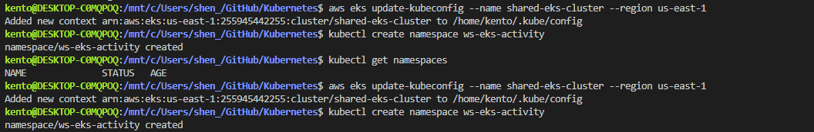   
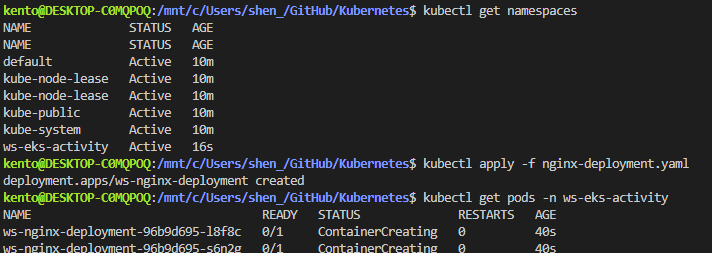   
   
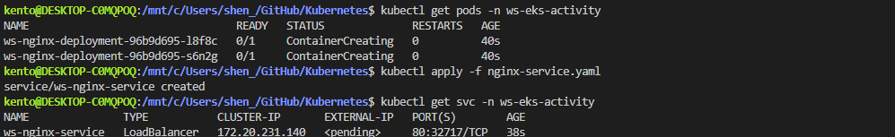   
   
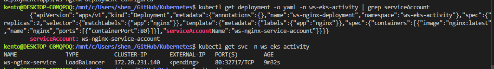   
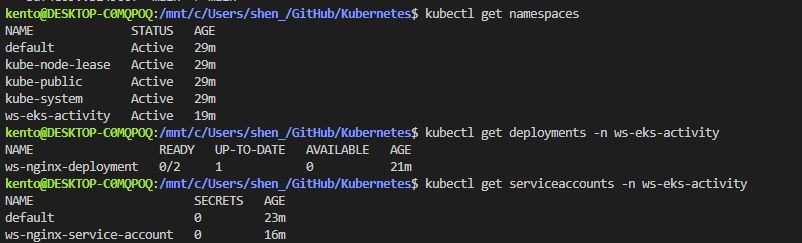     
      
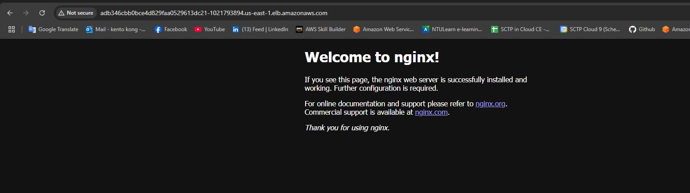   

Deployment:   
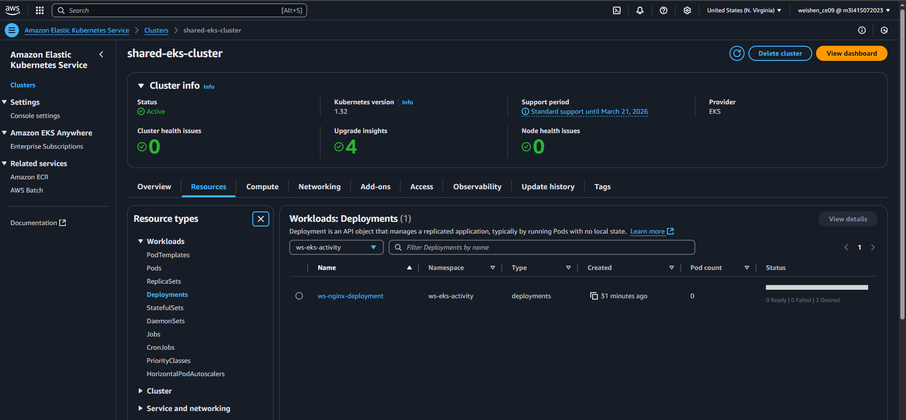   
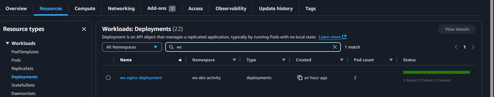  
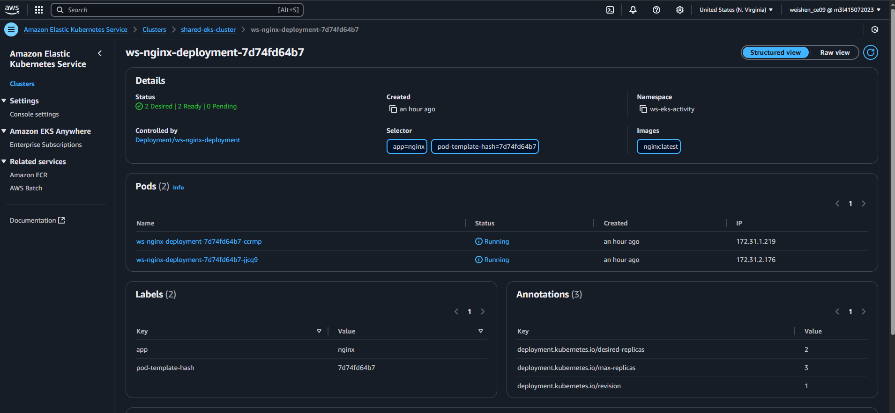   

Pod:   
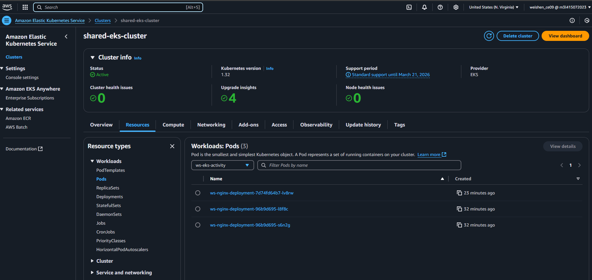   
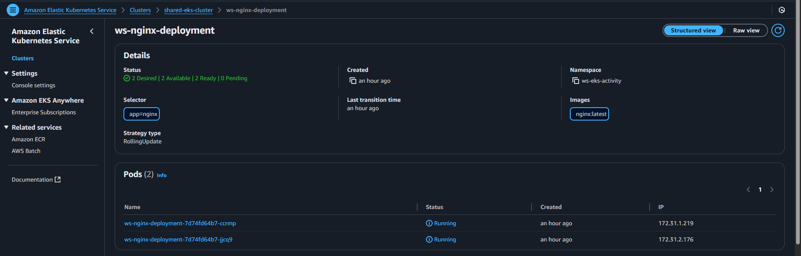   

Replica:   
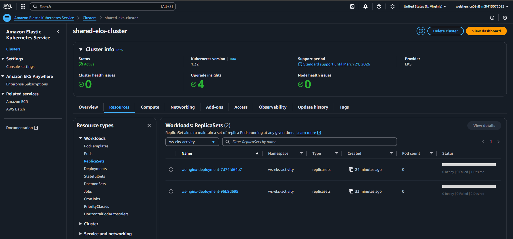   

Node:   
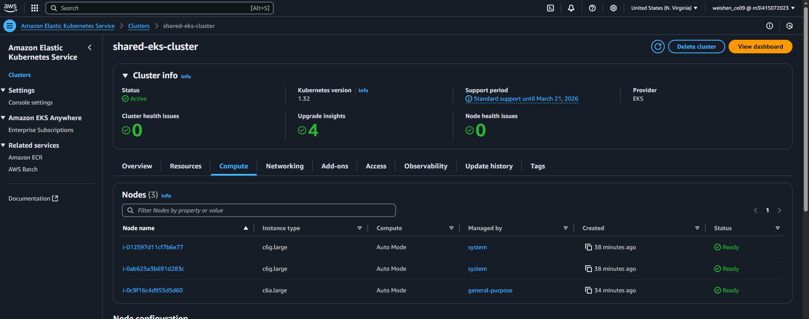   

Services:
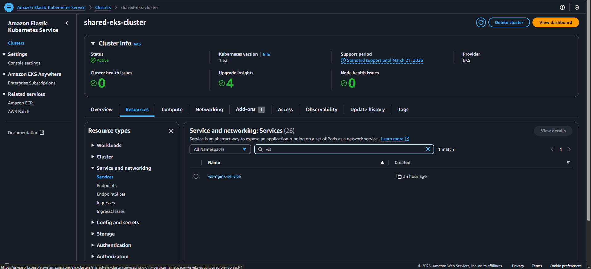   
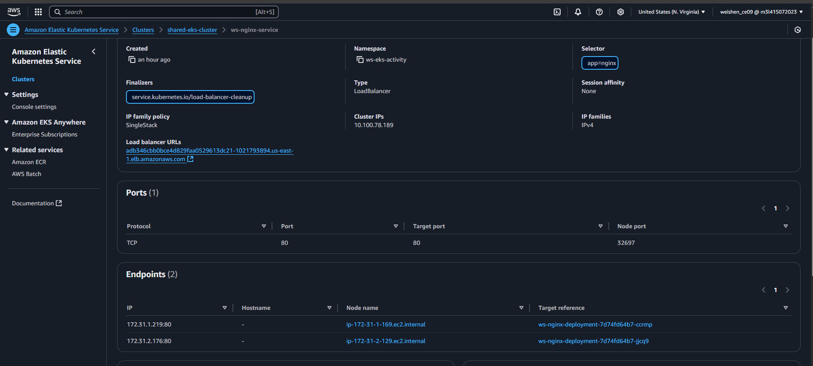   
Load Balancer URL:   
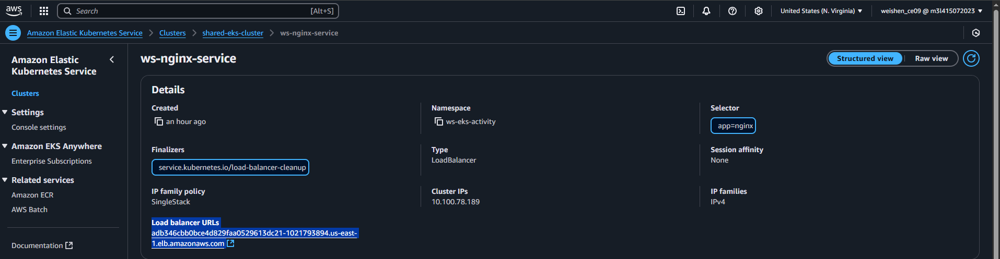   

`kubectl get pods`
